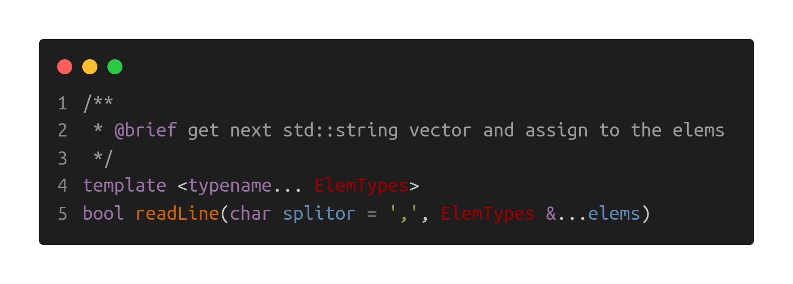
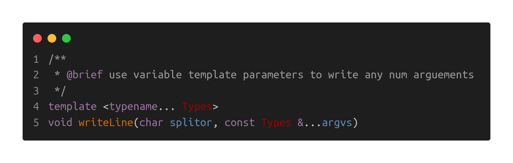

# CSV Handler

>___Author : csl___    

>___E-Mail : 3079625093@qq.com___

[TOC]

## 1. OverView
This is a library implemented with cpp macros to read and write CSV files. It is simple and universal.
```txt
                                                                            
  _|_|_|    _|_|_|  _|      _|  _|    _|                            _|  _|                      
_|        _|        _|      _|  _|    _|    _|_|_|  _|_|_|      _|_|_|  _|    _|_|    _|  _|_|  
_|          _|_|    _|      _|  _|_|_|_|  _|    _|  _|    _|  _|    _|  _|  _|_|_|_|  _|_|      
_|              _|    _|  _|    _|    _|  _|    _|  _|    _|  _|    _|  _|  _|        _|        
  _|_|_|  _|_|_|        _|      _|    _|    _|_|_|  _|    _|    _|_|_|  _|    _|_|_|  _|        
                                                                            
```

## 2. Test Data Files

### 1. info.csv

```cpp
201901,Tom,81.1
201902,Jhon,
201903,Jerry,95.3
201904,,95.6
201905,Mary,81.1
201906,Lily,95.6
201907,Lina,95.3
201908,Jack,81.1
201909,Bob,81.1
201910,Stack,95.3
```

### 2. refpoint3f_h.csv

```cpp
id,x,y,z
9,0.0605643,0.897656,0.166507
8,0.274907,0.477732,0.436411
7,0.884707,0.0726859,0.753356
6,0.98255,0.365339,0.75641
5,0.328234,0.0474645,0.762198
4,0.701191,0.653919,0.526929
3,0.930436,0.686773,0.0668422
2,0.00769819,0.5297,0.0345721
1,0.519416,0.934693,0.678865
0,0.218959,0.45865,0.131538
```

### 3. refpoint3f.csv

```cpp
9,0.0605643,0.897656,0.166507
8,0.274907,0.477732,0.436411
7,0.884707,0.0726859,0.753356
6,0.98255,0.365339,0.75641
5,0.328234,0.0474645,0.762198
4,0.701191,0.653919,0.526929
3,0.930436,0.686773,0.0668422
2,0.00769819,0.5297,0.0345721
1,0.519416,0.934693,0.678865
0,0.218959,0.45865,0.131538
```

## 3. Methods 

### 1. Read CSV

#### 1). class object



+ ___CSVReader[IFS]___

```cpp
void test_CSVReader_IFS() {
  ns_log::info("test the ns_csv::CSVReader[IFS], file '../data/info.csv'");

  std::ifstream ifs("../data/info.csv");
  ns_csv::CSVReader::Ptr readerIFS = ns_csv::CSVReader::create(ifs);
  int id;
  std::string name;
  float score;
  while (readerIFS->readLine(',', id, name, score)) {
    std::cout << Info(id, name, score) << std::endl;
  }
  ifs.close();
}
```

+ ___CSVReader[FILE]___

```cpp
void test_CSVReader_FILE() {
  ns_log::info("test the ns_csv::CSVReader[FILE], file '../data/info.csv'");

  ns_csv::CSVReader::Ptr reader = ns_csv::CSVReader::create("../data/info.csv");
  int id;
  std::string name;
  float score;
  while (reader->readLine(',', id, name, score)) {
    std::cout << Info(id, name, score) << std::endl;
  }
}
```

#### 2). static methods

```cpp
/**
 * @brief read all items in the ifstream
 *
 * @param ifs the input fstream
 * @param splitor the splitor
 *
 * @return std::vector<itemType> data
 */
template <typename StructType, typename... MemPacks>
static std::vector<StructType> read(std::ifstream &ifs, char splitor);
```

```cpp
/**
 * @brief read all items in the ifstream with header
 *
 * @param ifs the input fstream
 * @param splitor the splitor
 *
 * @return std::vector<itemType> data
 */
template <typename StructType, typename... MemPacks>
static auto readWithHeader(std::ifstream &ifs, char splitor);
```

```cpp
/**
 * @brief read some items in the ifstream
 *
 * @param ifs the input fstream
 * @param splitor the splitor
 * @param itemNum the number of the items to read
 *
 * @return std::vector<itemType> data
 */
template <typename StructType, typename... MemPacks>
static std::vector<StructType> read(std::ifstream &ifs, char splitor, std::size_t itemNum);
```

```cpp
/**
 * @brief read some items in the ifstream with header
 *
 * @param ifs the input fstream
 * @param splitor the splitor
 * @param itemNum the number of the items to read
 *
 * @return std::vector<itemType> data
 */
template <typename StructType, typename... MemPacks>
static auto readWithHeader(std::ifstream &ifs, char splitor, std::size_t itemNum);
```

```cpp
/**
 * @brief read all items in the file
 *
 * @param fileName the file name
 * @param splitor the splitor
 *
 * @return std::vector<itemType> data
 */
template <typename StructType, typename... MemPacks>
static std::vector<StructType> read(const std::string &fileName, char splitor);
```

```cpp
/**
 * @brief read all items in the file with header
 *
 * @param fileName the file name
 * @param splitor the splitor
 *
 * @return std::vector<itemType> data
 */
template <typename StructType, typename... MemPacks>
static auto readWithHeader(const std::string &fileName, char splitor);
```

### 2. Write CSV

#### 1). class object



+ ___CSVWriter[OFS]___

```cpp
void test_CSVWriter_OFS() {
  ns_log::info("test the ns_csv::CSVWriter[OFS], file '../data/info.csv'");

  auto ps = ns_geo::PointSet3f::randomGenerator(10, 0.0f, 1.0f, 0.0f, 1.0f,
                                                0.0f, 1.0f);
  std::ofstream ofs("../data/point3f.csv");
  ns_csv::CSVWriter::Ptr writer = ns_csv::CSVWriter::create(ofs);
  writer->writeLine(',', "x+z", "x+y", "y-z", "z-y");
  for (const auto &p : ps)
    writer->writeLine(',', p.x(), p.y(), p.z());
  ofs.close();
}
```

+ ___CSVWriter[FILE]___

```cpp
void test_CSVWriter_FILE() {
  ns_log::info("test the ns_csv::CSVWriter[FILE], file '../data/info.csv'");

  auto ps = ns_geo::PointSet3f::randomGenerator(10, 0.0f, 1.0f, 0.0f, 1.0f,
                                                0.0f, 1.0f);
  ns_csv::CSVWriter::Ptr writer = ns_csv::CSVWriter::create("../data/point3f.csv");
  writer->writeLine(',', "x+z", "x+y", "y-z", "z-y");
  for (const auto &p : ps)
    writer->writeLine(',', p.x(), p.y(), p.z());
}
```

#### 2). static methods

```cpp
/**
 * @brief write data to a csv file
 *
 * @param ofs the out fstream
 * @param splitor the splitor
 * @param data the data array
 */
template <typename StructType, typename... MemPacks>
static void write(std::ofstream &ofs, char splitor, const std::vector<StructType> &data) ;
```

```cpp
/**
 * @brief write data to a csv file
 *
 * @param ofs the out fstream
 * @param splitor the splitor
 * @param header the header labels
 * @param data the data array
 */
template <typename StructType, typename... MemPacks>
static void writeWithHeader(std::ofstream &ofs, char splitor,
                            const std::array<std::string, sizeof...(MemPacks)> &header,
                            const std::vector<StructType> &data);
```

```cpp
/**
 * @brief write data to a csv file
 *
 * @param fileName the file name
 * @param splitor the splitor
 * @param data the data array
 */
template <typename StructType, typename... MemPacks>
static void write(const std::string &fileName, char splitor, const std::vector<StructType> &data);
```

```cpp
/**
 * @brief write data to a csv file with header
 *
 * @param fileName the file name
 * @param splitor the splitor
 * @param header the header labels
 * @param data the data array
 */
template <typename StructType, typename... MemPacks>
static void writeWithHeader(const std::string &fileName, char splitor,
                            const std::array<std::string, sizeof...(MemPacks)> &header,
                            const std::vector<StructType> &data);
```

## 4. Files

[info.csv](./data/info.csv)   

[point3f.csv](./data/point3f.csv)

[refpoint3f.csv](./data/refpoint3f.csv)
