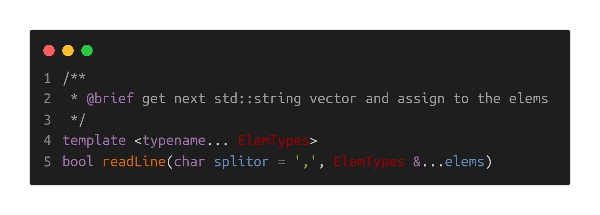
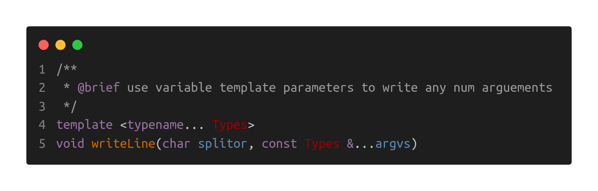

# CSV Handler

>___Author : csl___    

>___E-Mail : 3079625093@qq.com___

[TOC]

## 1. OverView
This is a library implemented with cpp macros to read and write CSV files. It is simple and universal.
```txt
                                                                            
  _|_|_|    _|_|_|  _|      _|  _|    _|                            _|  _|                      
_|        _|        _|      _|  _|    _|    _|_|_|  _|_|_|      _|_|_|  _|    _|_|    _|  _|_|  
_|          _|_|    _|      _|  _|_|_|_|  _|    _|  _|    _|  _|    _|  _|  _|_|_|_|  _|_|      
_|              _|    _|  _|    _|    _|  _|    _|  _|    _|  _|    _|  _|  _|        _|        
  _|_|_|  _|_|_|        _|      _|    _|    _|_|_|  _|    _|    _|_|_|  _|    _|_|_|  _|        
                                                                            
```

## 2. Test Data Files

### 2.1 [info.csv](./data/info.csv)

The following CSV file is incomplete, but does not affect data reading.

```cpp
201901,Tom,81.1
201902,Jhon,
201903,Jer ry,95.3
201904,,95.6
201905,Mary,81.1
201906,Lily,95.6
201907,Lina,95.3
201908,Jack,81.1
201909,Bob,81.1
201910,St ack,95.3
```

+ example 1: read all data

  + code

    ```cpp
    struct Info {
      int _id;
      std::string _name;
      float _score;
    };
    
    void test_READ_FILE_ALL() {
      ns_log::info("'test_READ_FILE_ALL'-'../data/info.csv'");
      auto data = ns_csv::CSVReader::read<CSV_STRUCT(Info, _id, _name, _score)>("../data/info.csv", ',');
      vecOutput(data);
    }
    ```

  + result

    ```cpp
    [info]-[1653792605.095598(S)] 'test_READ_FILE_ALL'-'../data/info.csv'
    {'id': 201901, 'name': Tom, 'score': 81.1}
    {'id': 201902, 'name': Jhon, 'score': 0}
    {'id': 201903, 'name': Jer ry, 'score': 95.3}
    {'id': 201904, 'name': , 'score': 95.6}
    {'id': 201905, 'name': Mary, 'score': 81.1}
    {'id': 201906, 'name': Lily, 'score': 95.6}
    {'id': 201907, 'name': Lina, 'score': 95.3}
    {'id': 201908, 'name': Jack, 'score': 81.1}
    {'id': 201909, 'name': Bob, 'score': 81.1}
    {'id': 201910, 'name': St ack, 'score': 95.3}
    ```

+ example 2: read some data

  + code

    ```cpp
    struct Info {
      int _id;
      std::string _name;
      float _score;
    };
    
    void test_READ_IFS_CER() {
      ns_log::info("'test_READ_IFS_CER'-'../data/info.csv'");
      std::ifstream ifs("../data/info.csv");
      auto data = ns_csv::CSVReader::read<CSV_STRUCT(Info, _id, _name, _score)>(ifs, ',', 4);
      vecOutput(data);
      ifs.close();
    }
    ```

  + result

    ```cpp
    [info]-[1653792605.095390(S)] 'test_READ_IFS_CER'-'../data/info.csv'
    {'id': 201901, 'name': Tom, 'score': 81.1}
    {'id': 201902, 'name': Jhon, 'score': 0}
    {'id': 201903, 'name': Jer ry, 'score': 95.3}
    {'id': 201904, 'name': , 'score': 95.6}
    ```

### 2.2 [refpoint3f_h.csv](./data/refpoint3f_h.csv)

A complete CSV file with header description information.

```cpp
id,x,y,z
9,0.0605643,0.897656,0.166507
8,0.274907,0.477732,0.436411
7,0.884707,0.0726859,0.753356
6,0.98255,0.365339,0.75641
5,0.328234,0.0474645,0.762198
4,0.701191,0.653919,0.526929
3,0.930436,0.686773,0.0668422
2,0.00769819,0.5297,0.0345721
1,0.519416,0.934693,0.678865
0,0.218959,0.45865,0.131538
```

example: read

+ code

  ```cpp
  struct RefPoint3f {
    std::size_t _id;
    float _x;
    float _y;
    float _z;
  };
  
  void test_READ_FILE_ALL_H() {
    ns_log::info("'test_READ_FILE_ALL_H'-'../data/refpoint3f_h.csv'");
    auto data = ns_csv::CSVReader::readWithHeader<CSV_STRUCT(RefPoint3f, _id, _x, _y, _z)>("../data/refpoint3f_h.csv", ',');
    ns_log::info("header: ", data.first.at(0), ',', data.first.at(1), ',',
                 data.first.at(2), ',', data.first.at(3));
    vecOutput(data.second);
  }
  ```

+ result

  ```cpp
  [info]-[1653792605.095761(S)] 'test_READ_FILE_ALL_H'-'../data/refpoint3f_h.csv'
  [info]-[1653792605.095891(S)] header: id,x,y,z
  {'id': 9, 'x': 0.0605643, 'y': 0.897656, 'z': 0.166507}
  {'id': 8, 'x': 0.274907, 'y': 0.477732, 'z': 0.436411}
  {'id': 7, 'x': 0.884707, 'y': 0.0726859, 'z': 0.753356}
  {'id': 6, 'x': 0.98255, 'y': 0.365339, 'z': 0.75641}
  {'id': 5, 'x': 0.328234, 'y': 0.0474645, 'z': 0.762198}
  {'id': 4, 'x': 0.701191, 'y': 0.653919, 'z': 0.526929}
  {'id': 3, 'x': 0.930436, 'y': 0.686773, 'z': 0.0668422}
  {'id': 2, 'x': 0.00769819, 'y': 0.5297, 'z': 0.0345721}
  {'id': 1, 'x': 0.519416, 'y': 0.934693, 'z': 0.678865}
  {'id': 0, 'x': 0.218959, 'y': 0.45865, 'z': 0.131538}
  ```

## 3. Methods 

### 3.1 Read CSV file

#### 3.1.1 static methods

```cpp
/**
 * @brief read all items in the ifstream
 *
 * @param ifs the input fstream
 * @param splitor the splitor
 *
 * @return std::vector<itemType> data
 */
template <typename StructType, typename... MemPacks>
static std::vector<StructType> read(std::ifstream &ifs, char splitor);
```

```cpp
/**
 * @brief read all items in the ifstream with header
 *
 * @param ifs the input fstream
 * @param splitor the splitor
 *
 * @return std::vector<itemType> data
 */
template <typename StructType, typename... MemPacks>
static auto readWithHeader(std::ifstream &ifs, char splitor);
```

```cpp
/**
 * @brief read some items in the ifstream
 *
 * @param ifs the input fstream
 * @param splitor the splitor
 * @param itemNum the number of the items to read
 *
 * @return std::vector<itemType> data
 */
template <typename StructType, typename... MemPacks>
static std::vector<StructType> read(std::ifstream &ifs, char splitor, std::size_t itemNum);
```

```cpp
/**
 * @brief read some items in the ifstream with header
 *
 * @param ifs the input fstream
 * @param splitor the splitor
 * @param itemNum the number of the items to read
 *
 * @return std::vector<itemType> data
 */
template <typename StructType, typename... MemPacks>
static auto readWithHeader(std::ifstream &ifs, char splitor, std::size_t itemNum);
```

```cpp
/**
 * @brief read all items in the file
 *
 * @param fileName the file name
 * @param splitor the splitor
 *
 * @return std::vector<itemType> data
 */
template <typename StructType, typename... MemPacks>
static std::vector<StructType> read(const std::string &fileName, char splitor);
```

```cpp
/**
 * @brief read all items in the file with header
 *
 * @param fileName the file name
 * @param splitor the splitor
 *
 * @return std::vector<itemType> data
 */
template <typename StructType, typename... MemPacks>
static auto readWithHeader(const std::string &fileName, char splitor);
```

#### 3.1.2 class object



+ ___CSVReader[IFS]___

```cpp
void test_CSVReader_IFS() {
  ns_log::info("'test_CSVReader_IFS'''../data/info.csv'");
  std::ifstream ifs("../data/info.csv");
  ns_csv::CSVReader::Ptr readerIFS = ns_csv::CSVReader::create(ifs);
  Info i{};
  while (readerIFS->readLine(',', i._id, i._name, i._score)) {
    std::cout << i << std::endl;
  }
  ifs.close();
}
```

+ ___CSVReader[FILE]___

```cpp
void test_CSVReader_FILE() {
  ns_log::info("'test_CSVReader_FILE'-'../data/info.csv'");
  ns_csv::CSVReader::Ptr reader = ns_csv::CSVReader::create("../data/info.csv");
  Info i{};
  while (reader->readLine(',', i._id, i._name, i._score)) {
    std::cout << i << std::endl;
  }
}
```

### 3.2 Write CSV file

#### 3.2.1 static methods

```cpp
/**
 * @brief write data to a csv file
 *
 * @param ofs the out fstream
 * @param splitor the splitor
 * @param data the data array
 */
template <typename StructType, typename... MemPacks>
static void write(std::ofstream &ofs, char splitor, const std::vector<StructType> &data) ;
```

```cpp
/**
 * @brief write data to a csv file
 *
 * @param ofs the out fstream
 * @param splitor the splitor
 * @param header the header labels
 * @param data the data array
 */
template <typename StructType, typename... MemPacks>
static void writeWithHeader(std::ofstream &ofs, char splitor,
                            const std::array<std::string, sizeof...(MemPacks)> &header,
                            const std::vector<StructType> &data);
```

```cpp
/**
 * @brief write data to a csv file
 *
 * @param fileName the file name
 * @param splitor the splitor
 * @param data the data array
 */
template <typename StructType, typename... MemPacks>
static void write(const std::string &fileName, char splitor, const std::vector<StructType> &data);
```

```cpp
/**
 * @brief write data to a csv file with header
 *
 * @param fileName the file name
 * @param splitor the splitor
 * @param header the header labels
 * @param data the data array
 */
template <typename StructType, typename... MemPacks>
static void writeWithHeader(const std::string &fileName, char splitor,
                            const std::array<std::string, sizeof...(MemPacks)> &header,
                            const std::vector<StructType> &data);
```

#### 3.2.2 class object



+ ___CSVWriter[OFS]___

```cpp
void test_CSVWriter_OFS() {
  ns_log::info("'test_CSVWriter_OFS'-'../data/refpoint3f_h.csv'");
  std::ofstream ofs("../data/refpoint3f_h.csv");
  ns_csv::CSVWriter::Ptr writer = ns_csv::CSVWriter::create(ofs);
  writer->writeLine(',', "id", "x", "y", "z");
  for (const auto &p : rpsVec)
    writer->writeLine(',', p._id, p._x, p._y, p._z);
  ofs.close();
}
```

+ ___CSVWriter[FILE]___

```cpp
void test_CSVWriter_FILE() {
  ns_log::info("'test_CSVWriter_FILE'-'../data/refpoint3f_h.csv'");
  ns_csv::CSVWriter::Ptr writer = ns_csv::CSVWriter::create("../data/refpoint3f_h.csv");
  writer->writeLine(',', "id", "x", "y", "z");
  for (const auto &p : rpsVec) {
    writer->writeLine(',', p._id, p._x, p._y, p._z);
  }
}
```
